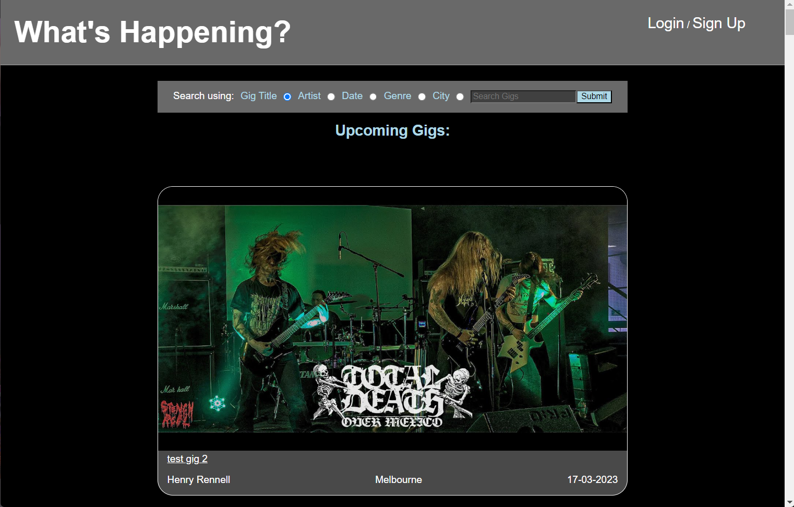
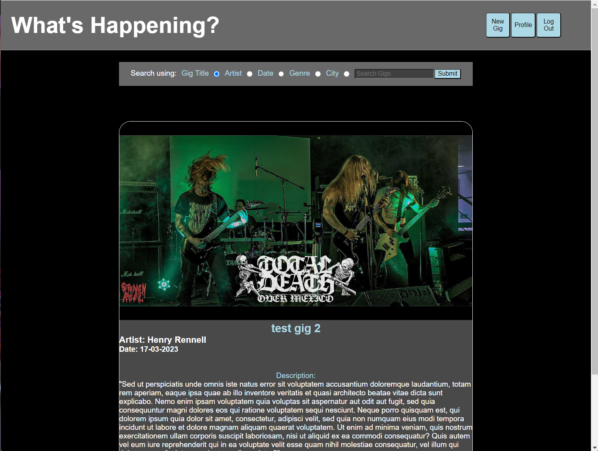

Henry's Project 2 - Whats Happening?
=====================================

Link to web app: 
----------------
https://whats-happening-app.onrender.com/
----------------

## Screenshots: 

### Main Feed:

## gig details page:

# Dynamically loaded CRUD app with RESTFUL conventions

using Nodejs, ExpressJs and a PostgreSql Database, this allows users to make an account and post small advertisements for gigs they are performing, with all CRUD operations.

## Introduction
==================
# Planning stages
Seeing as I had Been thinking about this concept for some time now, the planning was very straightforward to me.
-   I had already sketched wireframes of what i wanted the finished project to look like

# I knew that I wanted my app to:
-   Be able to suggest users gigs based on the location within their account;
-   Be able to search for gigs based on a number of parameters
-   Display a 'Profile Page' where users can see their own gigs

# Things I look forward to implementing in the future:
-   Comment section for each gig
-   'Interested In' feature, similar to a like button

Thankyou for Reading!

